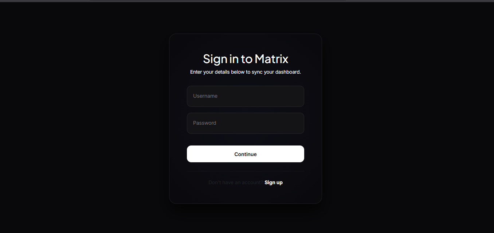
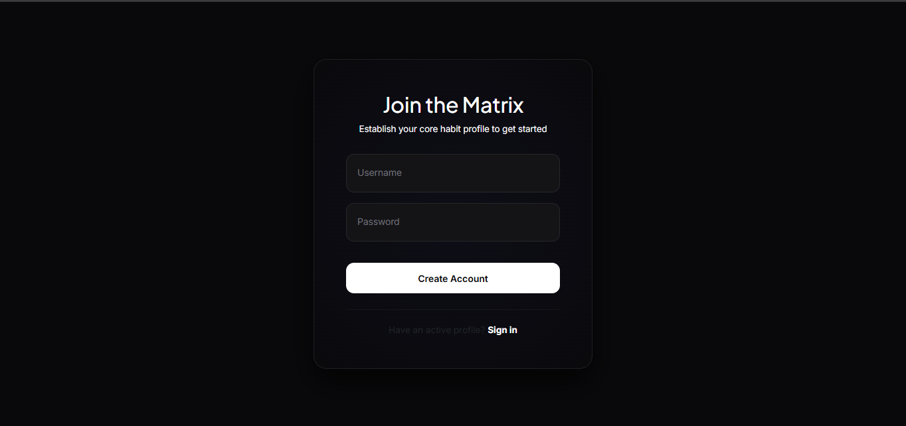
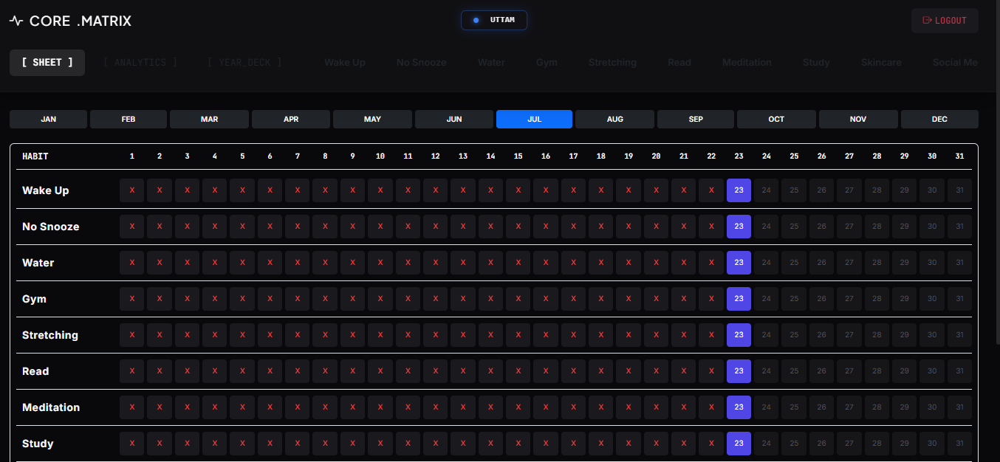
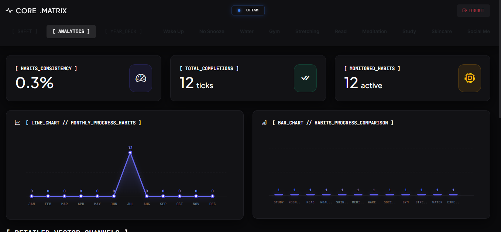
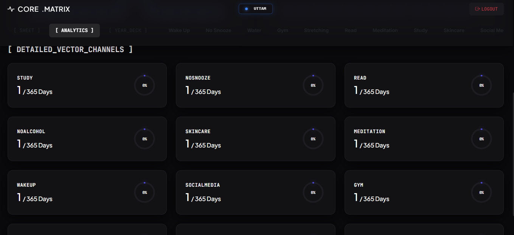
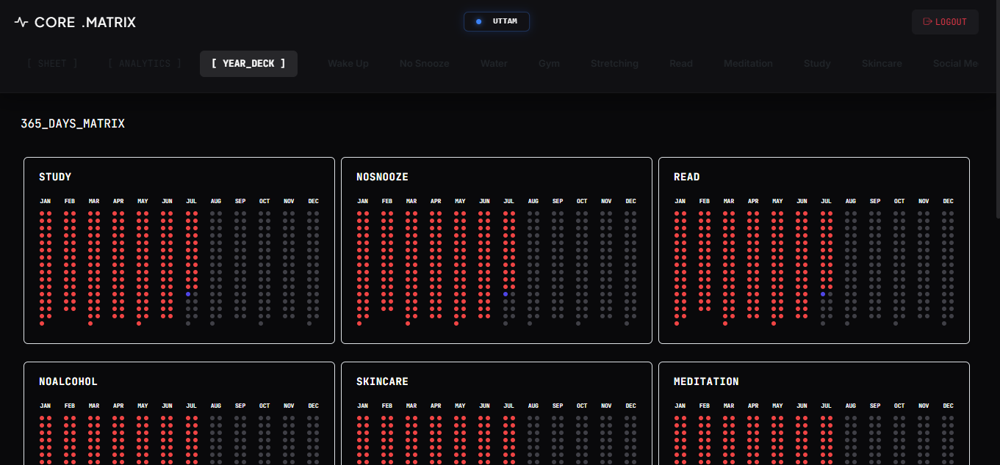
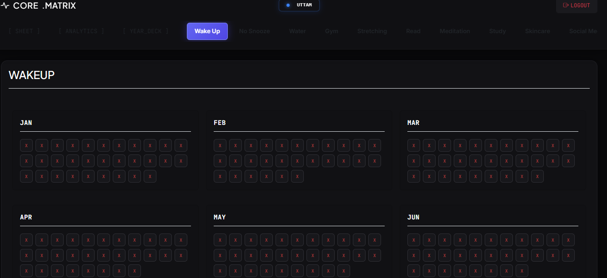

<div align="center">

# 🚀 CORE.MATRIX

### Modern Full-Stack Habit Tracking Platform

**Build Discipline • Track Progress • Visualize Consistency**


A production-ready **Full Stack Habit Tracking Application** built using **Spring Boot**, **React**, **TypeScript**, and **Neon PostgreSQL**.

Track habits, monitor progress, analyze consistency, and achieve your goals with an intuitive and responsive interface.

</div>

---

# 🌐 Live Application

### 🎨 Frontend

https://core-tracker-ui.vercel.app/

### ⚙️ Backend API

https://core-tracker-api-tyf8.onrender.com

---

# 📦 Source Code

### 🎨 Frontend Repository

https://github.com/Narra-Uttam-Kumar/core-tracker-ui

### ⚙️ Backend Repository

https://github.com/Narra-Uttam-Kumar/core-tracker-api

---

# ✨ Features

- 🔐 Secure User Authentication
- 🛡 Spring Security
- 🔑 JWT Authentication
- 🔒 BCrypt Password Encryption
- 📅 Daily Habit Tracking
- 📆 Monthly Habit Matrix
- 📊 Analytics Dashboard
- 📈 Detailed Statistics
- 🎯 Habit Goal Management
- 📱 Responsive UI
- ☁️ Cloud Deployment
- ⚡ RESTful APIs
- 🗄 PostgreSQL Database
- 📊 Interactive Charts

---

# 📸 Screenshots

| Login | Register |
|-------|----------|
|  |  |

| Habit Matrix | Analytics Dashboard |
|--------------|---------------------|
|  |  |

| Detailed Analytics | Year Overview |
|--------------------|---------------|
|  |  |

| Habit Details |
|---------------|
|  |

---

# 🏗️ System Architecture

```text
                 React + TypeScript (Vite)
                          │
                     HTTPS REST API
                          │
                          ▼
                Spring Boot Backend
                          │
       ┌──────────────────┼──────────────────┐
       ▼                  ▼                  ▼
 Controllers          Services        Spring Security
                          │
                    JWT Authentication
                          │
                    Spring Data JPA
                          │
                      Hibernate ORM
                          │
                          ▼
               Neon PostgreSQL Database
```

---

# 🛠️ Technology Stack

| Category | Technologies |
|-----------|--------------|
| Frontend | React 18, TypeScript, Vite |
| Backend | Java 21, Spring Boot 3 |
| Security | Spring Security, JWT, BCrypt |
| Database | PostgreSQL (Neon) |
| ORM | Hibernate, Spring Data JPA |
| Build Tool | Maven, npm |
| Deployment | Vercel, Render, Neon |

---

# 📂 Project Structure

```text
CORE-TRACKER

├── frontend
│   ├── components
│   ├── hooks
│   ├── utils
│   ├── assets
│   └── App.tsx
│
├── backend
│   ├── controller
│   ├── service
│   ├── repository
│   ├── security
│   ├── model
│   ├── dto
│   └── config
│
├── screenshots
│   ├── login.png
│   ├── register.png
│   ├── sheet.png
│   ├── analytics.png
│   ├── detailed.png
│   ├── year.png
│   └── habit.png
│
└── README.md
```

---

# 📡 REST APIs

## Authentication

```http
POST /api/auth/register
POST /api/auth/login
```

## Habit APIs

```http
GET    /api/habits

POST   /api/habits/toggle

PUT    /api/habits/goals

GET    /api/habits/analytics
```

---

# 🔐 Security

- JWT Authentication
- Spring Security
- BCrypt Password Encryption
- Stateless Session Management
- Protected REST APIs
- CORS Configuration

---

# ☁️ Deployment

| Component | Platform |
|-----------|----------|
| Frontend | Vercel |
| Backend | Render |
| Database | Neon PostgreSQL |

---

# ⚙️ Local Installation

## Clone Backend

```bash
git clone https://github.com/Narra-Uttam-Kumar/core-tracker-api.git
```

## Clone Frontend

```bash
git clone https://github.com/Narra-Uttam-Kumar/core-tracker-ui.git
```

---

## Backend

```bash
cd core-tracker-api

mvn clean install

mvn spring-boot:run
```

---

## Frontend

```bash
cd core-tracker-ui

npm install

npm run dev
```

---

# 🌍 Environment Variables

## Backend

```env
DB_URL=jdbc:postgresql://<host>/<database>?sslmode=require

DB_USERNAME=<username>

DB_PASSWORD=<password>

JWT_SECRET=<your-secret>

ALLOWED_ORIGINS=https://core-tracker-ui.vercel.app
```

---

## Frontend

```env
VITE_API_BASE_URL=https://core-tracker-api-tyf8.onrender.com/api
```

---

# 🚀 Future Enhancements

- 🤖 AI Habit Recommendations
- 📧 Email Notifications
- 📱 Mobile Application
- 🏆 Habit Streak Rewards
- 📊 Advanced Reports
- 📤 CSV / Excel Export
- 🌙 Dark & Light Themes
- 🔔 Push Notifications

---

# 💼 What This Project Demonstrates

- Enterprise Java Development
- Full Stack Development
- REST API Design
- Authentication & Authorization
- Spring Security
- PostgreSQL Database Design
- React + TypeScript Development
- Cloud Deployment
- Clean Architecture
- Production Ready Application

---

# 👨‍💻 Author

## Uttam Kumar Reddy

**Java Full Stack Developer**

### Skills

- Java
- Spring Boot
- Spring Security
- React
- TypeScript
- PostgreSQL
- Hibernate
- Spring Data JPA
- REST APIs
- JWT Authentication

---

<div align="center">

## ⭐ If you found this project helpful, consider giving it a Star!

Built with ❤️ using **Spring Boot**, **React**, **Render**, **Vercel**, and **Neon PostgreSQL**

</div>
